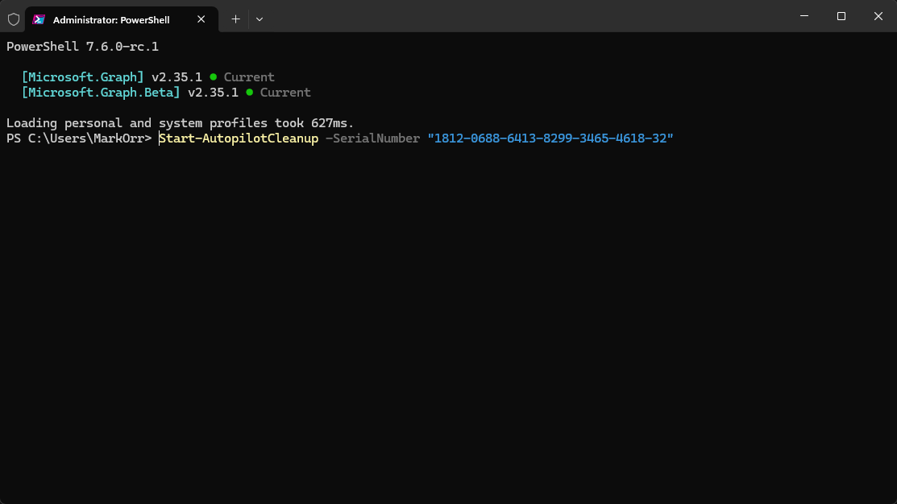

# 🧹 Autopilot Cleanup

[](https://youtu.be/SLvbbjJCvHo?si=lavT9N1emduIkFCH)

[Watch a Demo](https://youtu.be/SLvbbjJCvHo?si=lavT9N1emduIkFCH)


Interactive PowerShell tool for bulk device cleanup across Windows Autopilot, Microsoft Intune, and Microsoft Entra ID. Features automatic module installation, a cross-platform GliderUI selector, browser-based Microsoft Graph authentication, serial number validation, real-time deletion monitoring, and WhatIf mode for safe testing.

## 📸 Screenshots

| Device Selection Grid | Device Verification | Removal Monitoring | Single Device Removal |
|:---:|:---:|:---:|:---:|
|  |  |  |  |
| Cross-platform GliderUI selector with search & multi-select | Serial number validation & action menu | Real-time removal progress tracking | Direct serial number targeting |

## ✨ Features

- 📦 **Automatic Module Installation** - Checks for required Microsoft Graph and GliderUI modules and prompts to install missing dependencies
- 🖱️ **Interactive Device Selection** - Cross-platform GliderUI window with search, paging, and multi-select
- 🌐 **Browser-Based Authentication** - Opens your system browser with an account picker, matching the Entra-PIM sign-in experience
- 🔄 **Multi-Service Cleanup** - Removes devices from all three services (Autopilot, Intune, and Entra ID)
- 🔍 **Serial Number Validation** - Prevents accidental deletion of devices with duplicate names
- 🎯 **Direct Serial Number Targeting** - Target specific devices with `-SerialNumber` parameter, bypassing the interactive selector
- 📊 **Real-Time Monitoring** - Tracks deletion progress with per-service progress bars and automatic verification
- ⚡ **Parallel API Fetching** - Concurrent data retrieval on PowerShell 7+ using thread jobs
- 🚀 **Fast Bulk Removal Mode** - Bulk removal without status checking, with results exported to CSV
- 🔑 **Custom App Registration** - Configure a custom Entra app registration with persistent environment variables via `Configure-AutopilotCleanup` / `Clear-AutopilotCleanupConfig`
- 🔄 **Automatic Update Check** - Checks PowerShell Gallery for newer versions on launch
- 🏷️ **GroupTag Filtering** - Filter devices by GroupTag in the selection grid
- 👥 **Duplicate Handling** - Identifies and processes duplicate device entries
- 🧪 **WhatIf Mode** - Preview deletions without making actual changes
- ⚙️ **Edge Case Management** - Handles pending deletions, missing devices, and other scenarios
- 🔔 **Sound Notifications** - Plays success beeps when cleanup is complete

## 📋 Prerequisites

- PowerShell 7.4 or later
- Required modules (auto-installed if missing):
  - `Microsoft.Graph.Authentication`
  - `GliderUI`

## 🔐 Required Permissions

Your account needs the following Microsoft Graph API permissions:

- `Device.ReadWrite.All`
- `DeviceManagementManagedDevices.ReadWrite.All`
- `DeviceManagementServiceConfig.ReadWrite.All`

## 💻 Installation

1. Clone or download this repository
2. Open PowerShell
3. Navigate to the script directory
4. Run the script - it will automatically check and install required modules

```powershell
cd "/Users/maorr/maorr projects/irod/Autopilot-Cleanup"
pwsh ./Autopilot-Cleanup.ps1
```

Or import the module and use the `Start-AutopilotCleanup` command:

```powershell
Import-Module ./AutopilotCleanup/AutopilotCleanup.psd1 -Force
Start-AutopilotCleanup
```

## 🚀 Usage

### 🎯 Basic Usage

```powershell
pwsh ./Autopilot-Cleanup.ps1
```

1. Script will check for required modules and prompt to install if missing
2. Connects to Microsoft Graph (you'll be prompted to sign in)
3. Retrieves all Autopilot devices and enriches with Intune/Entra ID data
4. Displays the cross-platform device selector with all devices
5. **Select device(s), then press OK**
6. Confirms deletion from all three services
7. Monitors removal progress in real-time

### 🔑 Custom App Registration

Configure a custom app registration for delegated auth (persists across sessions):

```powershell
Import-Module ./AutopilotCleanup/AutopilotCleanup.psd1 -Force
Configure-AutopilotCleanup
```

By default, the tool opens a browser-based account picker with no tenant lock:

```powershell
pwsh ./Autopilot-Cleanup.ps1
```

Or pass a custom app registration directly:

```powershell
pwsh ./Autopilot-Cleanup.ps1 -ClientId "your-client-id" -TenantId "your-tenant-id"
```

To return to default browser auth after saving a custom tenant/app, run `Clear-AutopilotCleanupConfig`.

To clear saved configuration:

```powershell
Clear-AutopilotCleanupConfig
```

**Priority order:** command-line parameters > environment variables > default auth flow

**Required app registration settings:**
- Platform: Mobile and desktop applications
- Redirect URI: `http://localhost`
- Allow public client flows: Yes
- API Permissions (delegated): `Device.ReadWrite.All`, `DeviceManagementManagedDevices.ReadWrite.All`, `DeviceManagementManagedDevices.PrivilegedOperations.All`, `DeviceManagementServiceConfig.ReadWrite.All`

### 🧪 WhatIf Mode (Test Run)

Preview what would be deleted without making actual changes:

```powershell
pwsh ./Autopilot-Cleanup.ps1 -WhatIf
```

## 📝 Parameters

| Parameter | Type | Required | Description |
|-----------|------|----------|-------------|
| `-WhatIf` | Switch | No | Preview mode - shows what would be deleted without performing actual deletions |
| `-ClientId` | String | No | Client ID of a custom app registration for delegated auth |
| `-TenantId` | String | No | Tenant ID to use with the custom app registration |
| `-SerialNumber` | String[] | No | One or more serial numbers to target directly, bypasses the interactive selector |

## 🔧 How It Works

1. **Module Validation** - Verifies required PowerShell modules are installed
2. **Authentication** - Opens the system browser and connects to Microsoft Graph with required scopes
3. **Data Retrieval** - Fetches all Autopilot devices and enriches with Intune/Entra ID information
4. **Device Selection** - Displays a GliderUI-powered cross-platform selector where you choose devices to remove
   - Search, paging, and bulk-select buttons help with large tenants
   - Click a row to toggle it, then click **OK** to confirm
5. **Deletion Process** - Removes selected devices in the following order:
   - Microsoft Intune (management layer)
   - Windows Autopilot (deployment service)
   - Microsoft Entra ID (identity source)
6. **Verification** - Monitors and confirms successful removal from all services

## 📋 Device Selection Grid

The selector displays the following information:

| Column | Description |
|--------|-------------|
| DisplayName | Device display name |
| SerialNumber | Hardware serial number |
| Model | Device model |
| Manufacturer | Device manufacturer |
| GroupTag | Autopilot group tag |
| DeploymentProfile | Assigned deployment profile |
| IntuneFound | Whether device exists in Intune |
| EntraFound | Whether device exists in Entra ID |
| IntuneName | Device name in Intune |
| EntraName | Device name in Entra ID |

**✅ To select devices**:
- **Single device**: Click the row once to toggle it
- **Multiple devices**: Click additional rows to toggle them into the selection
- **Filtered devices**: Use the search box, then click **Select Filtered**
- **Current page**: Click **Select Page**
- **All selected devices**: Click **Clear Selection** to reset
- Click **OK** when finished selecting

## 📺 Example Output

```
[ A U T O P I L O T   C L E A N U P ]  v2.3.0
    with PowerShell

Auth: Default Microsoft Graph (delegated)

Checking required PowerShell modules...
✓ Module 'Microsoft.Graph.Authentication' is already installed
All required modules are installed.

Connecting to Microsoft Graph...
✓ Successfully connected to Microsoft Graph

Fetching all Autopilot devices...
Found 15 Autopilot devices

Processing: DESKTOP-ABC123 (Serial: 1234-5678-9012)
------------------------------

Step 1: Removing from Intune...
✓ Successfully queued device for removal from Intune

Step 2: Removing from Autopilot...
✓ Successfully queued device for removal from Autopilot

Step 3: Removing from Entra ID...
✓ Successfully queued device for removal from Entra ID

✓ Device successfully removed
  Name:           DESKTOP-ABC123
  Serial Number:  1234-5678-9012
```

## ⚠️ Important Notes

- 🚨 **Deletion is permanent** - Devices removed from these services cannot be easily restored
- 🔢 **Serial number validation** - The script validates serial numbers to prevent accidental deletion of duplicate device names
- ⚡ **Deletion order matters** - Devices are removed in the correct order (Intune → Autopilot → Entra ID) to prevent dependency issues
- ⏱️ **Monitoring timeout** - The script monitors deletion progress for up to 30 minutes
- 👤 **No admin required** - Module installation uses CurrentUser scope, avoiding the need for administrator privileges
- 🔔 **Success notification** - Three ascending beeps play when device cleanup is successfully verified across all services

## 🔧 Troubleshooting

### ❌ Modules Won't Install
- Ensure you have internet connectivity
- Run PowerShell with appropriate permissions
- Manually install modules: `Install-Module -Name Microsoft.Graph.Authentication,GliderUI -Scope CurrentUser`

### 🔒 Authentication Fails
- Verify your account has the required Graph API permissions
- Check if MFA is properly configured
- Try disconnecting and reconnecting: `Disconnect-MgGraph` then run the script again
- If a saved custom tenant/app keeps getting reused, run `Clear-AutopilotCleanupConfig`

### 🔍 Device Not Found
- Device may already be deleted
- Serial number or device name may be incorrect
- Check if device exists in each service individually

### ⏳ Deletion Hangs
- Large deletions can take time (up to 30 minutes)
- Check Azure portal to verify deletion status
- Script will timeout after 30 minutes of monitoring

## ⚙️ Environment Variables

| Variable | Description |
|----------|-------------|
| `AUTOPILOTCLEANUP_CLIENTID` | Saved app registration Client ID (set via `Configure-AutopilotCleanup`) |
| `AUTOPILOTCLEANUP_TENANTID` | Saved Tenant ID (set via `Configure-AutopilotCleanup`) |
| `AUTOPILOTCLEANUP_DISABLE_UPDATE_CHECK` | Set to `true` to skip the update check on launch |

## 📜 Version History

**Version 2.4.0**
- Switched default Microsoft Graph sign-in to browser-based authentication with account selection
- Browser auth now mirrors Entra-PIM
- Default auth no longer requires a TenantId; custom TenantId is only used when explicitly configured

**Version 2.3.0**
- Cross-platform GliderUI selector replaces the Windows-only WPF grid
- `GliderUI` added as a runtime dependency for interactive selection
- Minimum PowerShell version updated to 7.4
- `Start-AutopilotCleanup` module entry point implemented and exported
- Added `-ForceLogin` to force sign-in against a different tenant

**Version 2.2.4**
- Minimum PowerShell version updated to 7.0
- README updates: consolidated features list, updated version history and example output

**Version 2.2.3**
- Targeted API queries for `-SerialNumber` (no longer fetches entire tenant)
- WPF grid performance improvements (UI virtualization, CollectionView filtering, search debounce)

**Version 2.2.2**
- Fix `SerialNumber` parameter variable collision causing type conversion errors during device removal

**Version 2.2.1**
- Per-service progress bars during parallel fetch (page count and record count per service)
- Terminal indication when WPF device selection window is open
- Shared concurrent progress tracker for real-time thread job monitoring

**Version 2.2.0**
- `-SerialNumber` parameter for direct device targeting (single or multiple), bypasses the WPF grid
- Parallel API fetching on PowerShell 7+ using thread jobs (Autopilot, Intune, Entra ID fetched concurrently)
- Automatic fallback to sequential fetch if parallel jobs fail
- Progress bars during pagination for large tenant data retrieval

**Version 2.1.0**
- Custom app registration support (`Configure-AutopilotCleanup` / `Clear-AutopilotCleanupConfig`)
- `Start-AutopilotCleanup` module entry point
- Automatic update check from PowerShell Gallery
- Cleaner console UI - replaced heavy box-drawing with minimal section headers

**Version 2.0.0**
- PowerShell module architecture (Public/Private function structure)
- WPF device selection grid with search and multi-select
- Fast bulk removal mode with CSV export
- GroupTag filtering
- Serial number validation
- Real-time deletion monitoring
- WhatIf mode
- Automatic module installation

## 👨‍💻 Author

**Mark Orr**  
[](https://www.linkedin.com/in/markorr321/)

## 📄 License

This script is provided as-is without warranty. Use at your own risk.
